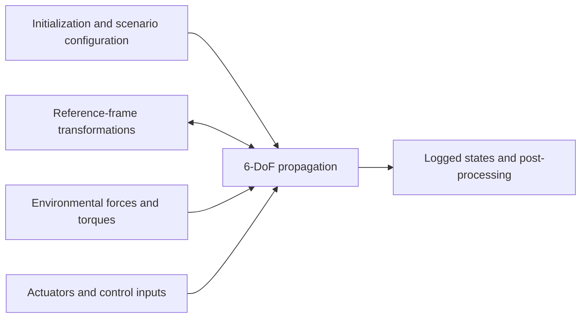

# 6-DoF LEO Satellite Simulator

A MATLAB/Simulink simulator for the coupled orbital and attitude dynamics of a rigid satellite in Low Earth Orbit (LEO). It was researched and developed from scratch by Allan Eloy Olivito during approximately 250 hours of supervised professional practice at the Centro Tecnológico Aeroespacial (CTA).

The simulator was designed as a configurable environment for studying environmental perturbations and testing attitude determination and control system (ADCS) algorithms. The source code, physical models, transformations, test campaigns, and post-processing tools are included in this repository.

> This is an engineering and educational simulator. Review the assumptions, model fidelity, and validation scope before using it for mission-critical work.

## Architecture



The state propagation combines:

- Translational dynamics: inertial position and velocity.
- Rotational dynamics: scalar-first attitude quaternion and body angular velocity.
- Applied forces and torques from configurable environment and actuator models.

## Implemented models

- Gravity: two-body, J2, or spherical harmonics up to degree 3.
- Atmospheric drag: exponential or US Standard Atmosphere-based density models.
- Satellite geometry: constant cannonball area or attitude-dependent projected area for a prism.
- Solar radiation pressure and cylindrical eclipse detection.
- Gravity-gradient torque.
- Geomagnetic field and torque. The WMM implementation uses Aerospace Toolbox; the surrounding model and integration are part of this project.
- Single-axis reaction wheel with torque, momentum, speed, and optional power limits.
- Commanded magnetic dipole interface for magnetorquer control.
- ECI, ECEF, LVLH, NED, geocentric, geodetic, and BODY frame transformations.
- Force, torque, orbit, ground-track, attitude, angular-rate, and nadir-error post-processing.

## Requirements

- MATLAB
- Simulink
- Aerospace Toolbox

The repository includes a compatibility copy of the main model for MATLAB/Simulink R2021a. Later versions may require Simulink to upgrade the model when it is opened.

## Quick start

1. Clone the repository and open MATLAB in `Simulink test`.
2. Add the project folders to the MATLAB path:

   ```matlab
   addpath(genpath(pwd))
   ```

3. Edit `Inicialización/INIT_parametros.m` to define the satellite, epoch, initial orbit and attitude, reference-frame transformation, and active environmental models.
4. Open `sim_orbit_min.slx` and run the simulation.
5. Run `Resultados/Plotting/RESULTS_plotter_main.m` to generate the available plots and summary from `logsout` or the latest Simulink Data Inspector run.

The initialization script includes preset 700 km circular equatorial, polar, and sun-synchronous-like cases, plus a custom state-vector option.

## Configuration overview

The main selectors are defined in `Inicialización/INIT_parametros.m`:

| Selector | Options | Purpose |
| --- | --- | --- |
| `ORBIT_CASE` | Custom or preset cases | Initial orbital state |
| `GRAV_MODEL` | N4, J2, SIMPLE | Gravity fidelity |
| `ATM_SEL` | US, EXP, NONE | Atmospheric density and drag |
| `GEOMAG_SEL` | ON, OFF | Geomagnetic perturbation |
| `SRP_SEL` | ON, OFF | Solar radiation pressure |
| `SAT_SHAPE` | Cannonball, prism | Effective projected area |
| `XFORM_MODE` | ERA-only, fixed correction | ECI-ECEF transformation |

## Control demonstration

The development case used a simple reaction-wheel controller in a circular equatorial orbit to keep the satellite pointed at nadir. The actuator interfaces are intended to be replaced or extended with other ADCS algorithms while the simulator provides the orbital environment, attitude dynamics, perturbations, and analysis outputs.

## Verification and validation

Two complementary test scripts are included:

- `Tests/TEST_aerospace_toolbox.m` compares individual transformations and physical-model outputs with Aerospace Toolbox references.
- `Tests/TEST_campaign.m` evaluates system-level behavior including state sanity, J2-driven RAAN precession, drag consistency, semi-major-axis decay, gravity-gradient torque, and geomagnetic update steps.

The simulator is considered verified within the assumptions and test scenarios documented by the project. This does not imply validation for every spacecraft or mission configuration.

## Repository structure

```text
Simulink test/
├── Dinámica/                  State propagation and Earth rotation
├── Inicialización/            Scenario and physical constants
├── Modelo Gravitacional/      Gravity force and torque models
├── Modelo de Drag/            Density, drag force, area, and torque
├── Modelo SRP/                Sun position, eclipse, force, and torque
├── Transformadas/             Reference-frame transformations
├── Tests/                     Verification and validation campaigns
├── Resultados/Plotting/       Post-processing and visualization
├── MD_RW.m                    Reaction-wheel model
├── MD_torque_magnetico.m      Magnetic torque model
└── sim_orbit_min.slx          Main Simulink model
```

## Background

The project began without a pre-existing simulator or codebase. Its central engineering challenge was selecting and implementing a suitable model for each perturbation while balancing computational performance and physical reliability. That required studying orbital and attitude dynamics, coordinate systems, environmental models, numerical implementation, and the available evidence about each model's accuracy.

Developed individually by **Allan Eloy Olivito** for the **Centro Tecnológico Aeroespacial** as part of his supervised professional practice.

## License

Released under the [MIT License](LICENSE).

---

## Español

Simulador desarrollado en MATLAB/Simulink para representar la dinámica orbital y actitudinal acoplada de un satélite rígido en órbita terrestre baja. Fue investigado e implementado desde cero por Allan Eloy Olivito durante aproximadamente 250 horas de Prácticas Profesionales Supervisadas en el Centro Tecnológico Aeroespacial.

El objetivo es ofrecer un entorno configurable para estudiar perturbaciones ambientales y probar algoritmos de determinación y control de actitud. Incluye los modelos físicos, transformaciones, campañas de verificación y herramientas de postproceso.

### Uso rápido

1. Abrir MATLAB dentro de `Simulink test`.
2. Ejecutar `addpath(genpath(pwd))`.
3. Configurar el escenario en `Inicialización/INIT_parametros.m`.
4. Abrir y ejecutar `sim_orbit_min.slx`.
5. Ejecutar `Resultados/Plotting/RESULTS_plotter_main.m` para analizar los resultados.

La demostración desarrollada utiliza un controlador simple con rueda de inercia en una órbita circular ecuatorial para mantener el satélite apuntando al nadir. Las interfaces de actuación permiten conectar o ampliar otros algoritmos ADCS.

El simulador fue verificado dentro del alcance y las hipótesis documentadas. Antes de utilizarlo en un caso crítico deben revisarse la fidelidad de los modelos y la configuración seleccionada.

El código se publica bajo la [Licencia MIT](LICENSE).
